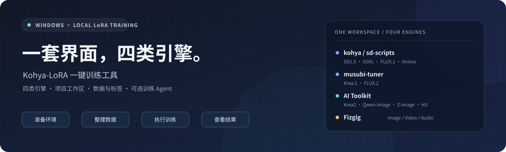
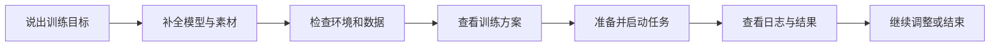

<p align="center">
  
</p>

<h1 align="center">Kohya-LoRA 一键训练工具</h1>

<p align="center"><strong>从准备图集，到训练自己的 LoRA，在一个 Windows 桌面工具里完成。</strong></p>

<p align="center">
  <a href="https://github.com/l1934332574-maker/Kohya-LoRA-Tool/releases/latest"></a>
  
  <a href="LICENSE"></a>
</p>

<p align="center">
  <a href="https://github.com/l1934332574-maker/Kohya-LoRA-Tool/releases/latest"><strong>下载安装包</strong></a> ·
  <a href="https://modelscope.cn/models/FGtiancai/Kohya-LoRA-Tool"><strong>国内下载</strong></a> ·
  <a href="#第一次训练">第一次训练</a> ·
  <a href="CHANGELOG.md">更新记录</a> ·
  <a href="https://github.com/l1934332574-maker/Kohya-LoRA-Tool/issues">反馈问题</a>
</p>

---

**你负责决定想让模型学到什么，工具帮你组织准备、配置、执行和查看结果。**

Kohya-LoRA 是围绕本地 LoRA 训练做的桌面工作台：整合四类训练引擎，提供项目管理、环境安装、模型下载、数据处理、训练方案、进度与采样查看。可以直接使用界面，也可以接入自己的文字模型，让可选的训练 Agent 通过对话帮助你完成任务。

适合第一次尝试训练人物、画风或概念 LoRA 的用户，也适合经常切换模型、需要管理多个训练项目的用户。底层仍使用对应引擎的训练能力，常用参数与高级设置都可以查看和调整。

> 本页介绍已发布的功能。安装包以 [Releases](https://github.com/l1934332574-maker/Kohya-LoRA-Tool/releases/latest) 为准；源码可能包含尚未打包的改动，具体变化见 [更新日志](CHANGELOG.md)。

## 先下载，再开始

| 你的使用方式 | 下载与启动 |
|---|---|
| **第一次使用，推荐安装版** | [GitHub Releases](https://github.com/l1934332574-maker/Kohya-LoRA-Tool/releases/latest) 下载 `Setup.exe`，安装后启动软件 |
| **国内网络** | [魔搭 / ModelScope](https://modelscope.cn/models/FGtiancai/Kohya-LoRA-Tool) 下载 `Setup.exe` |
| **希望解压就用** | Releases 下载 `KohyaLoraTool_*_portable.zip`，完整解压后运行 `Kohya一键工具.exe` |
| **希望修改代码** | 阅读下方 [从源码运行](#从源码运行) |

`Code → Download ZIP` 下载的是源码。普通用户请选择 Releases 中的安装包或便携包。

安装包提供桌面程序及配套资源；训练环境和所需底模按模式准备，基础模型没有全部装进软件。首次使用需要为组件、模型下载预留网络、时间和磁盘空间。

## 为什么选择这个工具

### 01 · 四类引擎，一套项目流程

同一个桌面入口可以使用 kohya / sd-scripts、musubi-tuner、AI Toolkit 和 Fizgig。新建项目后，界面根据当前模式显示对应的准备步骤、模型入口与适用参数。

**把不同架构的准备工作放在同一处管理。** 项目保存自己的图集路径、训练设置和输出位置；引擎与可复用的模型组件按各自规则管理。更换训练模式时，可以查看该模式的准备状态。

### 02 · 训练方案要能看懂，也能看见改了什么

六种方案按照使用意图命名，应用前展示 **参数 / 当前值 / 应用后** 的变化，支持撤销和继续手动调整。

| 方案 | 什么时候选 |
|---|---|
| **先跑通流程** | 短训练检查模型、数据和训练入口，先排除流程问题 |
| **快速试效果** | 减少训练量，先观察是否学到了目标特征 |
| **降低显存占用** | 使用当前模式支持的省显存设置，接受每步可能更慢 |
| **标准训练** | 从当前模式的常规配置开始，再根据结果调整 |
| **加快每步速度** | 显存有余量时，减少检查点和卸载等额外开销 |
| **增加训练量** | 需要更多训练步数或轮数时使用，并观察是否学过头 |

通用方案保留你设置的分辨率、学习率、手动量化与采样选项；个别引擎官方预设接管参数时，页面另行说明。省显存、每步速度和训练总量是不同的调整方向，具体变化以应用前的差异表为准。

### 03 · 从数据到结果，训练过程有据可查

| 你正在做的事 | 工具里的对应能力 |
|---|---|
| 准备训练素材 | 图片检查、重复处理、裁剪缩放；疑似模糊默认提醒并保留 |
| 准备标签或描述 | 内置 WD14、中文 / 英文自然语言描述、保留已有文本 |
| 核对训练集 | 原图与同名标签查看、标签编辑器、批量编辑、离线中英词典 |
| 调整参数 | 模式适用设置、训练方案差异表、开训预检与配置摘要 |
| 跟踪训练 | 区分预处理、缓存和正式训练，查看步数、Loss、速度与日志 |
| 比较训练效果 | 当前任务采样历史、固定种子、图片放大与 A/B 对比 |
| 安排多次实验 | 选择已保存项目加入训练队列，顺序执行预处理与训练 |
| 下次继续 | 保存项目、查看训练记录、恢复设置，按引擎能力选择断点续训 |
| 遇到问题 | 导出运行日志或本次训练反馈包，定位实际保存文件 |

队列在本次软件运行内有效，第三引擎 H3 视频项目暂不支持入队。

### 04 · 可以接入会调用工具的训练 Agent

从 **v0.19.0** 开始，新版界面提供可选的训练助手。它会读取工具提供的环境、项目和能力说明，使用真实的项目、下载、预处理与训练接口。

你可以从一句话开始：

> “我要训练一个人物 LoRA，图集已经有了，帮我把环境和参数准备好。”

缺少信息时，助手通过可点击选项和文件选择继续询问；准备完成后按所选权限展示方案或启动训练。任务仍在正常的进度窗口中显示，你可以查看实际日志，或交还控制后手动操作。

下面的“对话 → 任务”是交互流程示意：



助手支持连接兼容文字接口或本地 Ollama，需要使用你自己的服务、模型与密钥。**不接 AI，也可以使用常规界面完成训练。**

## 支持哪些模型与素材

| 引擎 | 当前接入的模型 / 模式 | 训练素材 |
|---|---|---|
| **第一引擎 · kohya / sd-scripts** | SD1.5、SDXL、FLUX.1、Anima | 图片 |
| **第二引擎 · musubi-tuner** | Krea 2、FLUX.2 | 图片 |
| **第三引擎 · AI Toolkit** | Krea2、Qwen-Image、Z-Image；MiniMax H3 视频模式 | 图像模式使用图片；H3 使用视频与同名字幕 |
| **第四引擎 · Fizgig** | Krea2、FLUX.2 Klein 9B、Qwen-Image-2.1、MiniMax H3 | 前三项使用图片；H3 接入图片 / 视频 / 音频与同名字幕 |

- 图像训练可按适用模式选择 **人物、画风或概念**；Qwen-Image 的模型版本在对应工作区选择。
- 同一模型家族可能有多个引擎入口，它们的依赖、参数、量化和显存策略各有不同。
- 第四引擎按模式提供量化选项，实际可用精度以当前模式、显卡通道及预检为准。
- H3 对媒体格式和组件有额外要求；文件能被扫描到，并不代表已经满足训练格式。
- 第三方底模需要匹配对应架构。已支持某个模型家族，不意味着任意合并模型、量化文件或结构变体都能训练。

### 显卡与运行环境

**Windows 10 / 11，NVIDIA 为主要支持路径。** 新版桌面界面使用 Microsoft Edge WebView2；经典界面保留作为兼容入口。

AMD 提供兼容模式、环境检查与 Fizgig ROCm 路径，是否能运行取决于具体显卡、驱动、引擎和模型。部分路径仍属实验性接入，不能按“支持 AMD”推断所有模式均已稳定。

显存需求随模型、分辨率、批大小、量化与采样变化。工具提供预检和适用的省显存设置，**不承诺所有模型都能在 8GB 显卡上运行**。采样还会额外占用显存；首次训练建议先跑通流程，再逐步增加训练规模。

## 第一次训练

首次下载与实际训练耗时取决于网络、素材和硬件。

1. **新建项目。** 选择想配合使用的底模与训练模式；项目会保存本次的图集、设置和输出位置。
2. **按引导准备环境。** 安装对应引擎，选择已有底模或使用下载入口准备所需组件。
3. **选择训练素材。** 图像模式选择图片目录；视频 / 音频按当前模式要求提供媒体与同名文本。
4. **选择描述方式。** 用 WD14 关键词、中文 / 英文描述，或保留你已有的标签。自然语言描述需要自行连接视觉服务。
5. **查看方案与数据。** 选择训练方案，查看实际参数变化；按需要设置 Trigger、分辨率和采样，并核对处理后的图集与标签。
6. **开始训练。** 查看预检摘要、任务进度、日志和可用的采样图。完成后打开当前项目输出目录取走 LoRA。

图片素材应围绕目标特征准备，通常需要多张、多角度或多种场景的样本；具体数量看模式提示。图片越多、Loss 越低、训练越久，都不能单独证明最终效果更好。

## 标签、描述与采样，按你的训练方式选

### 关键词标签与自然语言描述都保留

- **WD14 关键词**：使用内置打标入口，适合需要关键词标签的图像训练流程。
- **中文 / 英文描述**：连接兼容视觉接口或本地 Ollama 视觉模型；可先预览少量图片，再批量生成，默认补缺，覆盖前备份。
- **已有标签**：保留现有同名 `.txt`，在图集检查或标签编辑器中查看和修改。
- **人物与画风处理**：提供人物 Trigger、固定特征前缀和画风标签过滤等适用选项。

自动生成的文字仍需人工核对。文件完整性检查能够发现缺失或空标签，不能替你判断描述是否准确、图片是否适合训练。

### 用采样比较变化，使用固定条件

可以设置采样开关、间隔与种子，在训练窗口查看当前任务采样历史、放大图片或做 A/B 对比。保存模型和生成采样有各自的间隔；采样失败应结合实际日志检查。

**各引擎的采样稳定性仍在持续改进。** 已有采样入口不等于所有模式都能稳定出图；视频 / 音频产物按提示到输出目录查看。训练质量请结合固定底模、提示词、种子等条件下的实际生成结果判断。

## AI 助手能帮到哪一步

| 工作 | 当前范围 |
|---|---|
| 熟悉你的训练环境 | 读取软件提供的显卡、环境、项目和工具能力信息 |
| 补全需求 | 持续提问、可点击选项、文件 / 文件夹选择 |
| 准备与执行训练 | 调用项目配置、预处理、训练预检、开始 / 续训等已有流程 |
| 准备组件与模型 | 在授权范围调用安装流程，查询公开模型仓库并下载所选文件 |
| 排查失败 | 读取任务返回的日志与参数，建议调整，或调用已有的修复流程 |
| 电脑工具 | 限定范围的文本文件检查、打开网页，以及逐条确认后的 Windows 命令 |
| 保存上下文 | 按项目保存对话与执行记录，支持暂停、继续和手动接管 |

安装、下载、在线文字、在线图片与自动开始训练的权限分别设置。重启后保留记录，**不会自行恢复训练**；目前部分执行权限需要重新选择。

助手的效果取决于接入模型的理解和工具调用能力。目前不提供完整桌面视觉操控，也不承诺自动修复所有错误、适配任意模型或自动判断采样质量。

## 数据与隐私

**训练在本机执行。** 项目、处理后的数据、模型、训练产物和记录保存在本地；实际位置可在软件的数据目录入口查看。

| 情况 | 默认数据位置 |
|---|---|
| 新安装的打包版 | 安装目录同级的 `KohyaLoraTool_data` |
| 源码运行，或安装盘不可写 | `%APPDATA%\KohyaLoraTool` |
| 已保存自定义位置或旧数据位置 | 沿用当前配置，可在软件内查看与迁移 |

当前数据目录中，常用项目路径为：

```text
数据目录/
├─ projects/             项目配置
├─ dataset/              按项目组织的处理后数据
├─ output/<项目名>/      LoRA 与训练产物
├─ logs/                 日志
└─ agent_runs/           助手对话与执行记录
```

- 使用在线文字助手时，目标、对话、训练设置、工具结果与按需读取的日志会发送给你选择的服务。
- 在线图片描述需要单独允许发送图片；在线服务可能按照提供商规则收费。
- 助手与图片描述服务的 API 密钥使用 Windows 当前用户 DPAPI 加密保存。发布包不携带作者的密钥、个人服务配置或项目对话。
- 普通本地训练可以独立使用；环境安装、模型下载和更新仍需要对应网络资源。

## 常见问题

<details>
<summary><strong>需要自己装 Python、写训练命令吗？</strong></summary>

安装包用户从软件内引导准备对应训练环境；常规训练由工具生成配置并调用引擎。源码用户需要先准备桌面界面的运行依赖，见下方说明。

</details>

<details>
<summary><strong>已有底模、图集或训练环境，还要重新下载吗？</strong></summary>

可以选择已有的模型和图集。是否需要补组件由当前模式检查；第三引擎提供已有环境导入入口。不同引擎的环境要求可能不同，不能直接假定同一个环境可供全部引擎使用。

</details>

<details>
<summary><strong>训练变慢，是不是软件卡住了？</strong></summary>

先查看当前阶段和日志。模型加载、数据缓存、采样与正式训练分别需要时间；省显存卸载可能降低每步速度。若持续没有进展，导出日志并反馈当前阶段，避免只凭一次速度估算判断。

</details>

<details>
<summary><strong>可以断点续训吗？</strong></summary>

按当前引擎支持情况选择保存的训练状态继续。仅有导出的 LoRA 权重文件，不一定包含优化器等完整续训状态；续训也需要核对模型、图集和训练配置。

</details>

<details>
<summary><strong>新版页面空白或黑屏怎么办？</strong></summary>

经典界面保留在同一程序中。可以在软件快捷方式目标末尾追加 ` --ui classic`，临时通过经典界面启动；源码运行使用 `python kohya_gui.py --ui classic`。

反馈时请提供软件版本、安装版 / 源码版、Windows 和显卡信息，以及重开是否恢复。启动问题的修复与诊断入口请以对应版本更新记录为准。

</details>

## 从源码运行

源码入口是 `kohya_gui.py`，默认打开新版训练页。建议使用 **Python 3.12**；构建前端需要 **Node.js 20.19+ 或 22.12+**。

在仓库根目录执行：

```powershell
python -m pip install customtkinter pillow -r requirements-ui.txt
npm --prefix modern_ui ci
npm --prefix modern_ui run build
python kohya_gui.py
```

仅使用经典界面时：

```powershell
python -m pip install customtkinter pillow
python kohya_gui.py --ui classic
```

各训练引擎的环境仍建议通过软件内对应安装流程准备。前端开发、桥接与调试方式见 [modern_ui/README.md](modern_ui/README.md)。

<details>
<summary><strong>代码结构与进一步阅读</strong></summary>

| 路径 | 用途 |
|---|---|
| `kohya_gui.py` | 程序入口、经典界面与配套工具窗口 |
| `modern_ui/` | 新版 Vue 训练工作区、项目页与助手界面 |
| `gui/modern_host.py` | 桌面 WebView 与本地功能桥接 |
| `Kohya一键工具.py` | 训练、环境部署、下载及引擎适配核心 |
| `preprocess.py` | 图像预处理与标签处理 |
| `kohya_core/` | 项目配置、路径、训练记录、诊断及 Agent 等模块 |
| `model_downloader.py` | 模型与组件下载 |

- [完整使用说明](README_使用说明.md)：操作参考；较早章节请结合当前界面及更新记录阅读。
- [更新日志](CHANGELOG.md)：已发布版本变化与适用范围。
- [训练方案与采样体验说明](docs/训练方案与采样体验_实施清单_20261003.md)。
- [训练 Agent 交互与电脑工具说明](docs/训练Agent_交互与电脑工具改进_20261005.md)。

</details>

## 反馈与参与

欢迎通过 [GitHub Issues](https://github.com/l1934332574-maker/Kohya-LoRA-Tool/issues) 提交使用问题、界面建议或引擎适配需求，也欢迎提交 Pull Request。

训练问题请尽量附上 **软件版本、训练模式 / 引擎、显卡型号、复现步骤和导出的日志**。分享材料前检查私人路径、访问令牌和服务密钥；底模下载来源或结构差异也可能影响排查。

## 开源许可与致谢

本项目桌面工具以 **MIT License** 开源，见 [LICENSE](LICENSE)。训练引擎、模型和第三方资源遵循各自许可，详见 [THIRD_PARTY_NOTICES.md](THIRD_PARTY_NOTICES.md)。请使用你有权用于训练的素材。

感谢这些项目与社区提供的基础能力：

[kohya_ss](https://github.com/bmaltais/kohya_ss) ·
[sd-scripts](https://github.com/kohya-ss/sd-scripts) ·
[musubi-tuner](https://github.com/kohya-ss/musubi-tuner) ·
[AI Toolkit](https://github.com/ostris/ai-toolkit) ·
[Fizgig](https://github.com/shootthesound/Fizgig) ·
[WD14 / SmilingWolf](https://huggingface.co/SmilingWolf)

---

<p align="center"><strong>先把流程跑通，再把自己的想法训练出来。</strong></p>
